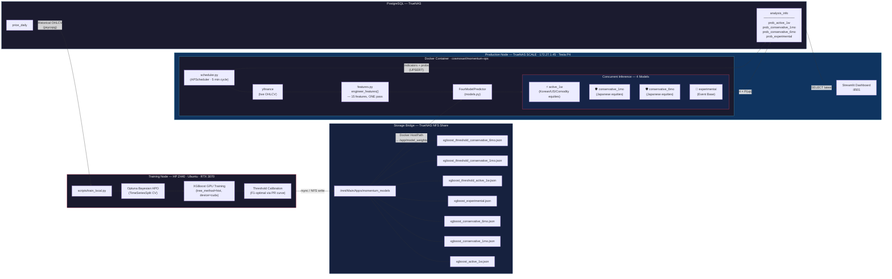

# momentum-ops — Architecture (Current State)

> **Last updated:** 2026-02-20
> **Author:** Engineering — Principal Staff review
> **Status:** Production

---

## System Overview

momentum-ops is a single-container, multi-model inference system for directional
equity probability estimation. Training is decoupled from inference: a local GPU
workstation produces XGBoost artifacts that are hot-swapped into a remote
production container via an NFS bridge, with zero downtime and no container
rebuilds.

---

## Architecture Diagram



---

## 1. Decoupled Compute — RTX 3070 (Train) ↔ Tesla P4 (Infer)

The system deliberately separates GPU workloads across two physically distinct
machines:

| Role | Hardware | Location | GPU | Workload |
|------|----------|----------|-----|----------|
| **Training** | HP Z440 | Local Workstation | NVIDIA RTX 3070 (8 GB VRAM) | Optuna HPO, XGBoost `hist` training, threshold calibration |
| **Inference** | TrueNAS SCALE | 172.27.1.45 | NVIDIA Tesla P4 (8 GB VRAM) | 4-model `predict_proba` on every scheduler tick |

### Why separate them

**Memory isolation.** Optuna trials instantiate dozens of transient
`XGBClassifier` copies across 5-fold `TimeSeriesSplit` CV. At peak, the RTX 3070
holds the full feature matrix in CUDA pinned memory, multiplied by the number of
concurrent Optuna workers. Running this alongside a production inference loop on
the same GPU would cause unpredictable OOM evictions and inference latency spikes.

**Duty-cycle mismatch.** Training is a batch job launched ad-hoc (operator runs
`python scripts/train_local.py --tune --strategy active --horizons 1w`). Inference
is a soft-realtime loop (APScheduler fires `run_ingestion_cycle` every 5 minutes).
Co-locating them would require complex mutex coordination or GPU context switching
that adds engineering cost for zero accuracy improvement.

**Zero-downtime model swaps.** The NFS bridge decouples the artifact write
(training node) from the artifact read (production container). After training
completes, the new `.json` files land on `/mnt/Main/Apps/momentum_models` — the
same directory that Docker's HostPath bind-mount exposes inside the container at
`/app/model_weights`. `FourModelPredictor` lazy-loads models on first use; a
container restart picks up the new weights with no rebuild, no re-tag, and no
redeployment.

---

## 2. Multi-Model Inference — Single Pass, Four Models

### The four production models

| Model Key | Artifact | Strategy | Horizon | Investment Mandate |
|-----------|----------|----------|---------|-------------------|
| `active_1w` | `xgboost_active_1w.json` | Active | 5 trading days | Korean equities — high-volatility momentum trades. Trained with a 1.5% hurdle to filter noise from the KRX's characteristically wide intraday ranges. |
| `conservative_1mo` | `xgboost_conservative_1mo.json` | Conservative | 21 trading days | Japanese equities — mid-term foundational holds. The 3.0% hurdle reflects the lower volatility and yen-hedged nature of TSE-listed positions. |
| `conservative_6mo` | `xgboost_conservative_6mo.json` | Conservative | 126 trading days | Japanese equities — long-term structural positions. The 7.5% hurdle ensures only genuine multi-month trends pass the classification gate, ignoring reversion noise. |
| `experimental` | `xgboost_experimental.json` | Experimental | Varies | Sandbox slot for research models — event-driven, sector rotations, or new horizon experiments. Not tied to a specific market mandate. |

### Why a single feature pass matters

Every ingestion cycle, `scheduler.py` calls `engineer_features()` **exactly
once** per ticker. This function computes all 15 features from the raw OHLCV
DataFrame:

```
RSI(14), MACD(12,26,9) + signal + histogram, Bollinger Bands(20,2) + %B,
ATR(14), rolling volatility(20), lagged log-returns(1,2,3,5,10)
```

The resulting single-row feature vector is then passed to `FourModelPredictor`,
which loops it through each of the four loaded `XGBClassifier` instances:

```python
# models/models.py — FourModelPredictor.predict_from_ohlcv()
features = engineer_features(df)       # ONE call
row = features.dropna().tail(1)        # ONE row

for key in MODEL_REGISTRY:
    results[key] = predictor.predict_proba(row)   # same row, different weights
```

This is critical for container health. `engineer_features()` allocates a
temporary DataFrame containing rolling windows, EWMAs, and diff arrays — roughly
15× the input row count in working memory. Running it once and reusing the output
avoids a 4× memory amplification that the previous 18-model architecture would
have imposed. On the Tesla P4's 8 GB VRAM (shared with the host's CUDA runtime),
this is the difference between stable operation and periodic OOM kills.

### Database schema (post-migration 004)

```sql
CREATE TABLE analysis_info (
    id              SERIAL PRIMARY KEY,
    ticker          VARCHAR(10) NOT NULL,
    date            DATE NOT NULL,
    rsi             DECIMAL(10, 4),
    macd            DECIMAL(10, 4),
    macd_signal     DECIMAL(10, 4),
    macd_hist       DECIMAL(10, 4),
    bb_upper        DECIMAL(12, 4),
    bb_middle       DECIMAL(12, 4),
    bb_lower        DECIMAL(12, 4),
    prob_active_1w          REAL,
    prob_conservative_1mo   REAL,
    prob_conservative_6mo   REAL,
    prob_experimental       REAL,
    created_at      TIMESTAMPTZ DEFAULT CURRENT_TIMESTAMP,
    UNIQUE(ticker, date)
);
```

One row per ticker per day. The `UPSERT` (`ON CONFLICT ... DO UPDATE`) ensures
idempotent writes — the scheduler can safely re-run without duplicating data.

---

## 3. Thresholding — Handling Class Imbalance from Strict Hurdle Rates

### The problem

XGBoost's `predict_proba()` outputs a raw `P(class=1)` value calibrated against
the training distribution. When the target label uses a strict hurdle (e.g.,
"close must rise ≥ 1.5% in 5 days"), the positive class is significantly
outnumbered. Empirically, the `active_1w` target (1.5% hurdle) yields roughly
35–40% positive labels. The longer horizons with higher hurdles can skew even
harder.

Applying a naïve 0.50 decision boundary in this setting maximises accuracy but
destroys recall — the model learns to predict "Down/Flat" for everything and still
scores 60%+ accuracy.

### The solution

`train_local.py` addresses this at two levels:

**1. `scale_pos_weight` during training.** The training script computes the
empirical class ratio `n_neg / n_pos` and passes it as `scale_pos_weight` to
XGBoost. During Optuna HPO, this value is further tuned within ±50% of the
empirical ratio, allowing the optimiser to find the gradient-weighting sweet
spot.

```python
# scripts/train_local.py — build_dataset()
n_pos = int(y.sum())
n_neg = len(y) - n_pos
spw = n_neg / max(n_pos, 1)
```

**2. F1-optimal threshold exported as a sidecar file.** After final training, the
script sweeps the precision-recall curve to find the threshold that maximises the
F1 score:

```python
# scripts/train_local.py — _find_optimal_threshold()
precision, recall, thresholds = precision_recall_curve(y_true, proba)
f1_scores = 2 * (precision[:-1] * recall[:-1]) / (precision[:-1] + recall[:-1] + 1e-12)
best_idx = np.argmax(f1_scores)
return thresholds[best_idx]
```

This optimal threshold is serialised alongside the model artifact:

```
model_artifacts/
├── xgboost_active_1w.json                  ← model weights
├── xgboost_threshold_active_1w.json        ← {"threshold": 0.4217, "hurdle": 0.015, ...}
├── xgboost_conservative_1mo.json
├── xgboost_threshold_conservative_1mo.json
├── xgboost_conservative_6mo.json
├── xgboost_threshold_conservative_6mo.json
└── xgboost_experimental.json
```

At inference time, `DirectionPredictor._load()` reads the threshold sidecar and
stores it as `self._threshold`. The dashboard or any downstream consumer can use
this value to convert a raw probability into a binary Up/Down signal without
re-deriving the threshold from production data (which would introduce a
train/serve feedback loop).

### Hurdle rates by horizon

| Horizon | Trading Days | Hurdle | Rationale |
|---------|-------------|--------|-----------|
| 1 day   | 1           | 0.5%   | Noise floor for single-day moves |
| 1 week  | 5           | 1.5%   | Standard momentum threshold |
| 1 month | 21          | 3.0%   | Scales ~√(21/5) × 1.5% |
| 6 months| 126         | 7.5%   | Structural trend filter |
| 1 year  | 252         | 10.0%  | Regime-change detection |

Hurdle rates scale roughly with the square root of the horizon, reflecting the
empirical observation that price dispersion grows sub-linearly over time
(consistent with a mean-reverting volatility process).

---

## Appendix: Key File Map

| File | Role |
|------|------|
| `scripts/train_local.py` | GPU training script — Optuna HPO, XGBoost, threshold export |
| `models/features.py` | Single source of truth for 15 engineered features |
| `models/models.py` | `FourModelPredictor` — registry-driven lazy loader + inference |
| `ingestion/scheduler.py` | APScheduler loop — yfinance → features → 4-model inference → DB |
| `database/schema.sql` | DDL for `analysis_info` (4 probability columns) |
| `database/db.py` | `insert_analysis()` — UPSERT with 13 parameters |
| `dashboard/predictions_tab.py` | Streamlit gauge UI — 4-model selector |
| `docker-compose.yml` | 3-service stack (postgres, scheduler, dashboard) |
